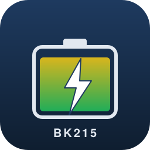

# ioBroker.bk215

[](https://www.npmjs.com/package/iobroker.bk215)
[](https://www.npmjs.com/package/iobroker.bk215)


[](https://nodei.co/npm/iobroker.bk215/)

**Tests:** 

## BK215 Battery Storage adapter for ioBroker

Local-first integration of the **Sunlit / SunEnergyXT BK215** balcony power-plant battery storage system, with optional **PI-based zero-feed-in control** driven by an external grid meter (e.g. Shelly Pro 3EM).

This adapter talks to the BK215 directly over its local TCP/JSON protocol on port 8000 — no cloud round-trip, sub-second control loop, full data sovereignty.

**Manufacturer / device documentation:**

- SunEnergyXT BK215: <https://www.sunenergyxt.com/balkonkraftwerkspeicher>
- Local mode setup guide: <https://www.sunenergyxt.com/entdecken/steuerung/home-assistant/how-to-enable-battery-local-mode-and-retrieve-battery-information>

## Features

- Local-only TCP/JSON communication with the BK215 (port 8000)
- Automatic device discovery via mDNS (`_http._tcp.local.` / `hp-bk215`)
- Live monitoring: SoC, charging power, mode, BMS limits, expansion modules
- Manual control: charging-power setpoint, mode toggling, SoC limits
- Optional **incremental PI controller** for zero feed-in (configurable Kp, Ki, deadband, interval, target)
- Subscribes to a configurable external grid-meter state (Shelly 3EM, Tibber Pulse, …)
- **Fail-safe behaviour**: stale grid data, lost TCP link, or SoC out of range forces the BK215 output to a safe value
- Resilient TCP reconnect with exponential backoff
- Compact-mode compatible
- Sensitive credentials encrypted at rest (`encryptedNative`)

## Hardware compatibility

| Device                          | Required firmware |
| ------------------------------- | ----------------- |
| Sunlit / SunEnergyXT BK215      | ≥ 1.5.7           |
| Sunlit / SunEnergyXT BK215 Plus | ≥ 4.0.3           |

The **Local Mode** must be enabled in the Sunlit Solar app — see the manufacturer setup guide above.

## Quick start

1. **Install** the adapter from the ioBroker admin UI (once published) or directly from GitHub:

   ```bash
   npm install https://github.com/Sven-83/sunlit/tarball/main
   ```

2. **Create an instance** in the admin UI.

3. **Connection tab**: either enter the BK215 IPv4 address manually, or leave it empty and enable mDNS discovery.

4. **Grid meter tab**: pick the ioBroker state that holds the net active power. For a Shelly Pro 3EM this is typically `shelly.0.Shelly3EMPro-XXXXXX.Total.act_power`. The picker has a tree browser.

5. **Controller tab**: set Kp/Ki/deadband/interval. Defaults (Kp 0.7, Ki 0.05, deadband 30 W, interval 4 s) work for most installations.

6. **Safety tab**: SoC min/max and a safety buffer in percentage points.

7. Save. The adapter starts, mirrors device telemetry into states, and — if the controller toggle is on — begins regulating.

## States

| State                              | Role                | R/W | Description                                |
| ---------------------------------- | ------------------- | :-: | ------------------------------------------ |
| `info.connection`                  | indicator.connected |  R  | TCP link to BK215 alive                    |
| `info.lastSync`                    | value.time          |  R  | Last successful status report              |
| `info.firmwareVersion`             | info.firmware       |  R  | Reported firmware                          |
| `battery.soc`                      | value.battery       |  R  | Overall state of charge (%)                |
| `battery.chargingPower`            | value.power         |  R  | Currently configured charging power (W)    |
| `battery.chargingPowerSetpoint`    | level.power         | R/W | Manual setpoint override (W)               |
| `battery.localMode`                | indicator           | R/W | Local mode enabled on device               |
| `battery.homeApplianceMode`        | indicator           | R/W | Zero-feed-in mode enabled on device        |
| `battery.socMinLimit`              | level               | R/W | Min discharge SoC (1–20 %)                 |
| `battery.socMaxLimit`              | level               | R/W | Max charge SoC (70–100 %)                  |
| `grid.power`                       | value.power         |  R  | Mirrored, smoothed net grid power (W)      |
| `grid.lastUpdate`                  | value.time          |  R  | Last meter timestamp                       |
| `grid.stale`                       | indicator           |  R  | Grid data older than configured timeout    |
| `controller.enabled`               | switch              | R/W | PI controller on/off                       |
| `controller.error`                 | value               |  R  | Current PI error term (W)                  |
| `controller.integral`              | value               |  R  | Persisted integral term (survives restart) |
| `controller.lastUpdate`            | value.time          |  R  | Last controller iteration                  |
| `safety.failSafeActive`            | indicator.alarm     |  R  | Safe state active (output forced to 0 W)   |
| `safety.lastReason`                | text                |  R  | Reason for last fail-safe trigger          |

## Safety reason reference

`safety.lastReason` carries human-readable text. The underlying reason ID is one of:

| Reason ID                | Meaning                                                          |
| ------------------------ | ---------------------------------------------------------------- |
| `bk215-link-down`        | TCP link to the BK215 is closed                                  |
| `bk215-data-stale`       | No status report from the BK215 within the watchdog window       |
| `bk215-local-mode-off`   | Device is not in local mode — SET commands would be ignored      |
| `grid-data-missing`      | No grid-meter reading has ever arrived                           |
| `grid-data-stale`        | Grid-meter reading is older than the configured timeout          |
| `soc-unknown`            | SoC has not yet been reported by the BK215                       |
| `soc-below-min`          | SoC fell below `socMin + socSafetyBuffer`                        |
| `soc-above-max`          | SoC exceeded `socMax`                                            |

When any of these triggers, the controller writes 0 W and stops regulating until the condition clears.

## Tuning the PI controller

The default gains (Kp = 0.7, Ki = 0.05, deadband = 30 W, interval = 4 s) work well for an 800 W inverter behind a Shelly Pro 3EM at 1 Hz update rate.

If you observe **persistent overshoot** after a load change, lower Kp first (try 0.5).

If the controller is **slow to reach zero** under steady load, raise Ki (try 0.08).

If you see **chatter** on the BK215 output, raise the deadband (try 50 W) or the interval (try 5 s).

The integral is persisted in `controller.integral`, so the controller picks up where it left off after an adapter restart — no cold-start spike.

## Troubleshooting

| Symptom                                    | Likely cause / fix                                                                       |
| ------------------------------------------ | ---------------------------------------------------------------------------------------- |
| `info.connection` stays false              | Wrong IP, BK215 not on the same VLAN, port 8000 firewalled, local mode disabled in app   |
| Connection cycles every minute             | Idle watchdog firing because device is not streaming — check FW version requirement      |
| `safety.lastReason = bk215-local-mode-off` | Open the Sunlit Solar app and enable local mode                                          |
| `safety.lastReason = grid-data-stale`      | Shelly state is not updating — check the Shelly adapter, raise `gridStaleTimeoutS`       |
| Controller never sends a value             | Open `controller.enabled` and verify it is `true`, plus a grid-state path is configured  |

## Acknowledgements

- Protocol structure inspired by the **MIT-licensed Python reference implementation** by Sonnenladen GmbH ([sunenergyxt-api](https://github.com/SonnenladenGmbH/sunenergyxt-api)), in collaboration with the SunEnergyXT R&D team.
- Initial protocol notes from the simon42 community thread.

This project is independent and is not affiliated with or endorsed by Sunlit Solar, SunEnergyXT, or Sonnenladen GmbH.

## Disclaimer

This adapter actively controls power-electronic equipment. Always operate within the manufacturer's published limits. The authors accept no liability for loss of revenue, equipment damage, or grid-side events. **Use at your own risk.**

## Development

Requires Node 20 or 22.

```bash
npm install
npm run build       # compile TypeScript
npm run check       # strict type-check
npm run lint        # ESLint
npm run test:unit   # unit tests (no I/O)
npm run test:package
```

## Changelog

See [CHANGELOG.md](CHANGELOG.md).

## License

MIT — see [LICENSE](LICENSE).
